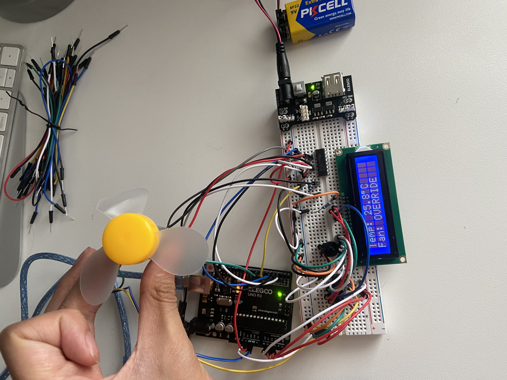

# Arduino Remote-Controlled Fan with Temperature Sensor, IR Remote, and LCD display via shift register
This project is an embedded system that controls a DC fan based on temperature input from a DHT11 sensor, includes manual override via an IR remote, and displays real-time status using an LCD1602 screen connected through a 74HC595 shift register. It demonstrates real-world applications of control logic, sensor interaction, modular software design, and user interaction. 

## Live Photos

## Features
- Automatic fan activation at >= 25 degrees Celsius
- Manual ON/OFF control via IR remote (NEC protocol)
- Lockout logic: fan remains OFF after manual override, even if temperature remains above threshold
- Real-time display of fan status and temperature on an LCD (only 3 Arduino pins used via shift register)

## System Architecture

The codebase is structured modularly and developed in logical stages, reflecting the top-down design and bottom-up implementation approach I took. Various diagnostic tests are included for individual components to ease debugging.

Diagnostic tests:

- 'fan_test.ino' - Testing L293D motor driver and fan direction/speed control.
- 'ir_test.ino' - Confirms IR remote signal decoding
- 'dht_test.ino' - Verifies standalone functionality of the DHT11 sensor
- 'lcd_test.ino' - Confirms LCD + 74HC595 communication

System integration:
  
- 'fan2.ino' - Adds IR remote functionality for manual toggle to the existing fan
- 'fan_dht.ino' - Adds DHT11 temperature sensor and automatic fan logic to the existing fan + IR receiver
- 'fan_lcd.ino' - Final version: adds LCD1602 with shift register for low pin usage to the existing fan + IR receiver + DHT11 sensor 

## Hardware Used
- Elegoo Uno R3 (Arduino-compatible)
- 9V battery with snap-on connector clip
- Power supply module (for stable motor voltage)
- L293D motor driver IC
- 3-6V DC motor with attached fan blade
- IR receiver + remote (NEC protocol)
- DHT11 temeprature sensor (10k pull-up resistor between DATA and VCC for stability)
- Breadboard and jumper wires
- LCD1602 display
- 10k potentiometer (for LCD contrast)
- 74HC595 shift register
- 220 ohm resistors for A pin on LCD, and for stability between the arduino and the shift register

## How It Works
- The system reads the temperature every 2 seconds from the DHT11 sensor.
- If the temperature is 25 degrees Celsius or higher and no manual override is active, the fan turns ON automatically.
- Pressing the "Power" button on the IR remote toggles the fan and engages/disengages the manual override.
- This fan remains OFF if manually overridden, regardless of temperature.
- The LCD displays the current temperature and fan status, updated only when values change to preserve clarity and avoid flicker.

## Future Improvements
- Add proportional fan speed control based on temperature gradient
- Integration with WiFi (ESP32) for remote monitoring

## Real-World Use Cases

This project's control logic can be extended to a wide range of embedded and IoT applications where autonomy and human input must work together reliably, including:

- Environmental Chambers: Automated cooling/heating with manual override during testing.
- Smart HVAC systems: Efficiemt and user-friendly climate control in smart homes.
- Server Cooling Systems: Reliable fan activation with technician overrides for safety.
- Greenhouses & Vertical Farming: Temperature-triggered airflow control with optional user input.
